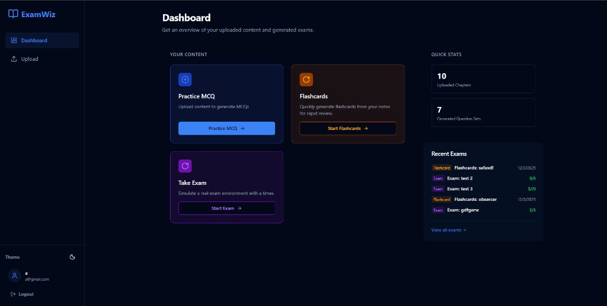

# ExamWiz
**Your AI-Powered Study Companion**

ExamWiz is an intelligent educational platform designed to revolutionize how students prepare for exams. By leveraging advanced Artificial Intelligence, ExamWiz transforms static study materials into dynamic, interactive learning experiences.

## The Problem
Students often struggle to test their knowledge effectively before exams. Creating flashcards and practice questions manually is time-consuming and inefficient.

## The Solution
ExamWiz automates the study process. Simply upload your notes, textbooks, or slides, and let our AI instantly generate tailored practice exams and revision tools.

## Key Features

### 🚀 AI Question Generation
Instantly convert any text, PDF, or image into a comprehensive exam. Our AI understands context and generates high-quality Multiple Choice and Short Answer questions to test deep understanding.

### ⚡ Smart Flashcards
Accelerate memorization with auto-generated flashcards. Perfect for active recall and spaced repetition study techniques.

### 🎯 Practice Mode
Simulate real exam conditions with our Practice MCQ mode. Get instant feedback on your answers to identify weak areas immediately.

### 📊 Progress Dashboard
Track your learning journey. Our intuitive dashboard organizes all your study materials and exam history, giving you a clear view of your progress.

### 📱 Study Anywhere
Built with a modern, responsive design that works seamlessly on laptops, tablets, and phones. Study whenever and wherever inspiration strikes.

## How It Works

1.  **Upload**: Drag and drop your study materials (PDFs, images, notes) into the dashboard.
2.  **Customize**: Choose your preferred format—Flashcards, MCQs, or a Full Exam.
3.  **Generate**: Watch as ExamWiz analyzes your content and builds a custom study set in seconds.
4.  **Master**: Engage with the material, track your scores, and ace your exams.

---
*Ready to transform your study routine? Contact us to learn more about ExamWiz.*
